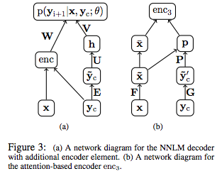
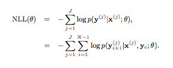
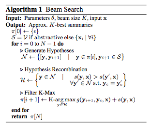
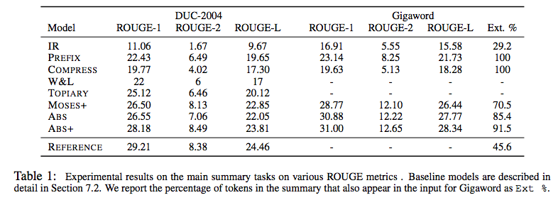

---

title: "A Neural Attiention Model for Abstractive Sentence Summarization"
date: "2017-02-05"
layout: post
path: "/attention_abstractive_sentence_summarization/"
category: "paper"
description: "A Neural Attiention Model for Abstractive Sentence Summarizationの概要"

---
## title
A Neural Attiention Model for Abstractive Sentence Summarization

## abstruct
抽出型のテキスト要約は本質的にげんかいたあるが、生成系の要約手法は成果が示されている。
本論文では、完全データドリブン型の手法を提案している。  
local attention-modelを要約の単語を生成する際に使用したところ、スケール可能な状態で高精度を出した。

## background
現状、文章要約にはextractive approachとabstractive approachがあり  
前者は元文章を切り貼りして、要約を作成しているのに対して、後者はボトムアップで要約を作成しているために、
出力された文章が、元の文章の一部と一致しているわけではない。  
本論文のモデルは、最近のNMTから影響を受けていて、NLMと文脈を捉えたencoderとを合体させている。  
attention-modelを採用し、潜在的はsoft alignmentを入力文章から学習し、要約時に使用する情報として利用している。

## method
基本的には文脈を理解しようとする、ニューラル言語モデルと同様な感じです。  
本論文ではencoderを下記の三種類紹介している
- bag-of-words encoder
- convolutional encoder
- attention-based encoder

attention-based enderは
<figure>
  
  <figcaption>model structure</figcaption>
</figure>
(b)のように、入力と出力を隠れ層に通したものと、context embeddingとinput embeddingをPでmapしたものを、掛け合わせることでenc()の出力としている。

学習では下記のNLL(θ)をmini-batch SGDで最小化している。
<figure>
  
  <figcaption>optimize function</figcaption>
</figure>

数ある要約の選択肢の中から最適なものを選択するにはbeam searchを使用している。
<figure>
  
  <figcaption>beam search</figcaption>
</figure>
Vの中からyを適宜選出しながら、scoring functionで選定しながら上位K個のものを出力としている。

Extension: Extractive Tuning sectionでは、scoring functionの出力値が低いときは、入力文章の単語をそのまま出力するようなことをしている。

## results  
<figure>
  
  <figcaption>result</figcaption>
</figure>
ABSがattention-basedのもので、ABS+はtunedされたもの。

## discussion
この手法で、名前や地名等は比較的うまく拾えていた。  
しかし、文法的に単語を正しく並べることができない例も見られた。  
今後は文法に正確であるものや、パラグラフレベルの要約を行いたいとのこと

## my impression
attention-basedでenc()を行っているところは簡単な手法で比較的綺麗な精度でalignmentを取れていて驚いた。  
論文中でも言われていたが、bow-basedのものとほとんどcontextを見ているところ以外は同じだがあれだけの精度が出るのは面白い。  
自分の中での期待としては、さらに広い範囲(文書)レベルでの要約や、時系列を見たもの(月報的な)ものが、若干飛躍してしまうが出てきたら面白い。

