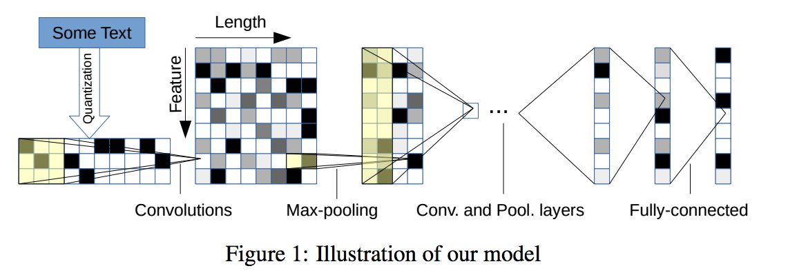
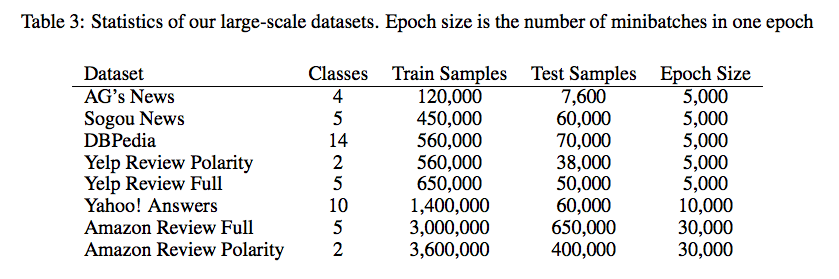
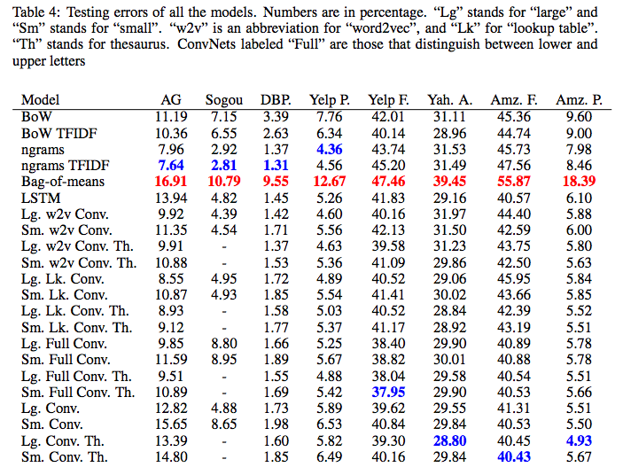

## title
Character-level Convolutional Networks for Text Classification

## abstruct
文字レベルでのCNNの利用の探求を目的としている、とともに大規模なcorpusも作成している。  
bag of words, ngrams, TFIDFや単語レベルでのConvNets、RNNと比較している。

## background
基本的にこれまでのテキスト分類タスクにおける手法は、単語や単語の並び(ngram)を最小単位としているものが最良の結果を収めていた。  
だが、多くの研究者はConvNetsが低レベルのシグナルから情報を抽出する際において良い結果を出すことを発見している(Computer Vision, 音声認識の分野において)。  
よって本論文ではテキストデータを文字レベルにおいて、低レベルな信号として扱いTemporal(one-dimentional) ConvNetsに応用することにした。またConvNetsは大量のデータセットを必要とすることが多いため、それも用意した。
以前の研究で、ConvNetsは分散的または分離的なembedding of wordsには言語における構文的、意味論的な知識を前提としなくても応用することができることが示されている。  
大規模データセットにおいて、深いConvNetsを利用した、単語への理解を要求しない応用は本研究が初となる。  
単語、構文、意味への理解を必要としないということは、ミススペリングや絵文字等の普通の状態ではない文字の組み合わせについても学習することができることを示唆している。

## method
基本的なネットワークの要素はTemporal Convolutional Netword、つまり1次元のConvolutional Networkである。pooling層では、深いネットワークで有用なことが知られているmax-poolingを使用している。  
max-poolingを使用したことにより、6層までConvNetsを深くしても学習を行うことができた。  
アルゴリズムとしてはmini-batchサイズは128でSGDとmomentumを用い、momentum 0.9を利用し、step-sizeの初期値は0.01で三回毎のepochで半分にして10epoch学習した。  

### Character quantization
本モデルは入力として、エンコードされた文字の並びであり、そのエンコードは下記の手順で実行される
1. size m のアルファベットの並びとして入力される
2. 1-of-m or one-hot encodingが施される -> feature(70) * length(1014)のベクトルが出来上がる
3. size m が最大文字列長(1014)を超えた際は切り捨て無視して、足りない際はスペース同様0で埋めた

### model design
<figure>
  
  <figcaption>model design</figcaption>
</figure>
ConvNetsを6層、fully-connected層を3層重ね、fully-connectedの間、つまり二つのdropoutを追加している。  
重みの初期値はガウシアン分布を用いている。
kernelは[1, k]の大きさの一次元ベルトルである。

### data augmentation using Thesaurus
本実験ではデータの一般科のためにデータ増強を辞書(Thesaurus)を用いて、同じ単語の同義語を調べることにより行った。

## results
### 比較対象のモデル
- Bag of Words and its TFIDF
- Bag of ngrams and its TFIDF
  - 最大5gram
- Bag of means and its TFIDF
  - 学習済みword2vecモデルを使用して、単語を300次元の分散表現に変換したものを使用して、それのbagを作った。
- Word based ConvNets
  - これも単語を学習済みword2vecモデルを使用して分散表現に変換したものを使用した。
- LSTM
  - 上記同様分散表現使用

### 使用したdatasets
<figure>
  
  <figcaption>datasets</figcaption>
</figure>

### 結果
<figure>
  
  <figcaption>results</figcaption>
</figure>

## discussion
- 文字レベルのConvNetsは有用であった
- データサイズが有用な手法を二分する
データサイズが数千程度のもののうちは古典的な手法(TFIDF)が有用であったが、それ以上になってくるとConvNetsが結果を超えてくる。
- ConvNetsはユーザが作成したデータに対して有用である。
amazonのuser reviewの用にデータが洗練されていないようなもの(誤字、脱字等が多い)に関しては、ConvNetsがいい結果を出しているように見えた。  
このことから、ConvNetsのより実世界への応用を期待することができる。
- アルファベットの大文字小文字の処理で結果が変わる。
- 感情分析とその他のクラスタリングの間に存在する意味論は、結果には寄与しない。
- データセットやタスクによって手法を切り替える必要があることが見えた
