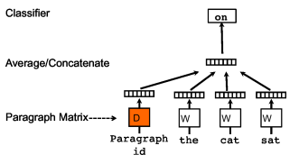
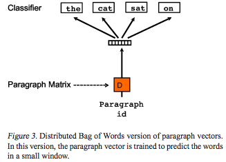
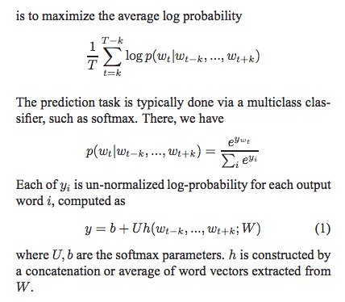
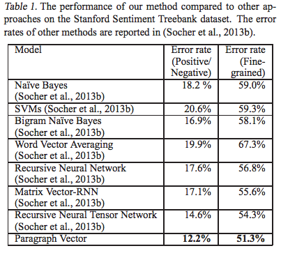

---

title: "Distributed Representations of Sentences and Documents"
date: "2017-02-10"
layout: post
path: "/doc2vec/"
category: "paper"
description: "Distributed Representations of Sentences and Documentsの概要"

---
## title
Distributed Representations of Sentences and Documents

## abstruct
bow of wordsは語順情報を捨てているが、本論文で提唱しているParagraph Vectorは教師なし学習で、多様な長さのテキストから固定長のベクトル特徴を学習する。  
結果としてbowを上回る性能を獲得することができた。

## background
bowはたくさんの不利益な点がある
- 語順を無視する
- それにより、同じ単語が使われているかぎり、異なる文章が同じ特徴表現を持つ可能性がある

bag of n-gramsはこれらの点を改善したと思われたが以下のデメリットがある。
- データの希薄さ
- 次元の大きさ

## method
<figure>
  
  <figcaption>PV-DM</figcaption>
</figure>

<figure>
  
  <figcaption>PV-DBOW</figcaption>
</figure>

<figure>
  
  <figcaption>式</figcaption>
</figure>

単語を転写して分散表現を作るように、Paragraphも1ofVベクトルから、行列を生成したものを上記の式の最小化をしながら学習して、分散表現を獲得する。

## results  
<figure>
  
  <figcaption>result</figcaption>
</figure>

## discussion
bog of words, bag of n-gramsを大きく上回る文章表現を獲得することができた。

## my impression
word2vecの拡張のような形で、Paragraphを混ぜ合わせながら、文章中の単語を予測しながら文章自体の分散表現を獲得するというのは面白い手法であった。  
Paragraphの意味理解をしているとは思いがたいが、分類タスクにおいて良い結果を出していることからは、良い形での像を獲得することはできているようである。  
Paragraphの単位をどれくらいまで小さくしても結果を保つことができるかは興味がある。
