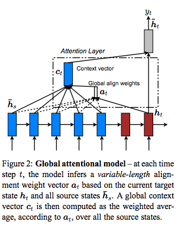
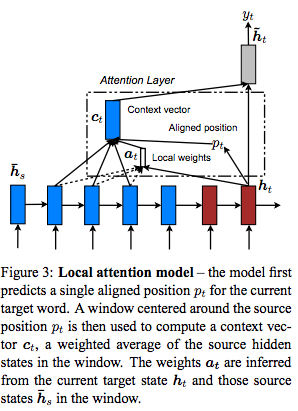
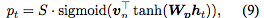
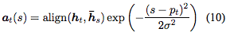

---

title: "Effective Approaches to Attention-based Neural Machine Translation"
date: "2017-03-29"
layout: post
path: "/effective_approaches_abnmt/"
category: "paper"
description: "Effective Approaches to Attention-based Neural Machine Translationの概要"

---
## title
Effective Approaches to Attention-based Neural Machine Translation

## abstruct
要約target文を生成する際にattentionをかけることが多くなってきたが、
参照するsource sentenceを全部見るglobal attentionと部分的に参照するlocal attentionを検証した。

## background

## method
### global, local違いまとめ
localは本論文中では、source sentenceの参照する部分を決定する方法ごとにさらに2つに分けて言及されている(Monotonic alignment (local-m), Predictive alignment (local-p))。  
- global
<figure>
  
  <figcaption>global attention</figcaption>
</figure>
alignmentを求めるのにsource sentence対応のhidden stateを使用する。よってa_tベクトルのサイズはsource sentenceの長さと対応する。  

- local
<figure>
  
  <figcaption>local attention</figcaption>
</figure>
alignmentを求める前に対象とするsource sentenceの部分を決定するp_tを求める。この求め方が二通りある
- local-m
単純にp_t = t (time step)としてしまう
- local-p
<figure>
  
  <figcaption>local-p</figcaption>
</figure>
p_tの位置をW, v 2つのパラメーターを更新しながら学習していく。
<figure>
  
  <figcaption>local-p</figcaption>
</figure>
p_tを中心にgaussian destributionを考えて次式を指定している。

alignmentの式に含まれるscoreの計算にも複数選択肢を本論文中では提案しているが割愛する。

## results  
local-pが最高精度を出した

## discussion

## my impression
local attentionを用いることでglobal attentionの課題であった計算量と長文での対応を同時に解決しているのはよくできてる。  
local-pでattentionの中央地点を学習しているが知識不足のせいかしっくりこない気がする。本論文は翻訳タスクに焦点を絞っているが、
長文に対するアプローチとしてのlocal attentionを他タスクにも応用がされそう（もうされてそう）
