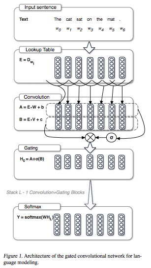
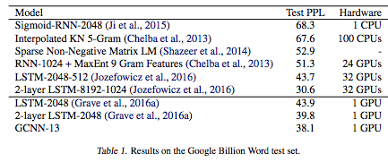

---

title: "Language Modeling with Gated Convolutional Networks"
date: "2017-02-20"
layout: post
path: "/gated_conv/"
category: "paper"
description: "Language Modeling with Gated Convolutional Networksの概要"

---
## title
Language Modeling with Gated Convolutional Networks

## abstruct
ゲート構造を用いたConvolutional Networkで言語モデルを構築するためのネットワークを構築する。  
分散計算可能な形で計算を高速化することも可能にしながら、強力なRNNを超えることに成功した。

## background
これまで使われてきた伝統的な統計的言語モデルは、データの希薄性により大きいコンテキストを表現することが難しかったが、  
LSTMの出現により、モデルが任意の長さの連続体を扱うことができるようになった。  
本論文では、gated convolutional networksを言語モデルタスクに適応する。convolutional networkを積み重ねることにより大きなコンテキストと階層的な表現をすることができる。  
またkernel sizeがあるため計算量を削ることもできる。  
また本論文で紹介するgated linear unitsは勾配消失問題を軽減する。

## method
<figure>
  
  <figcaption>model</figcaption>
</figure>
単語をV * mサイズのlook up tableでembeddingしてからモデルへの入力としている。  
隠れ層の計算は
<figure>
  
  <figcaption>hidden laryer computation</figcaption>
<figure>
としていて、重みWの方の項を、Vを掛け合わせsigmoidを通したものをelement-wise prodしたもので、調整したものを層の出力としている。  
このconvolution層とgating層をresidual blockでwrapして、出力に入力を足し合わせている。

### Gating Mechanisms
gating mechanismsはどの情報が次の層に伝わっていくのかを調整するために使用されている。  LSTMでは情報消失を防ぐためにforget gateなどを用意しているが、convolutional networksは勾配消失問題に遭遇しづらいためforget gate等を必要としないことがわかった。  
gating mechanismsを使用することで、どの単語、特徴が次の単語を予想するのに関連があるのか選択できるようにしている。  

## results  
<figure>
  
  <figcaption>result</figcaption>
</figure>

## discussion
提案手法を用いることによって、入力の階層的な表現を取得し、長い関連性を簡単に取得することができることを示した。

## my impression
GLUは単純なAttention機構のような印象を受けた。
