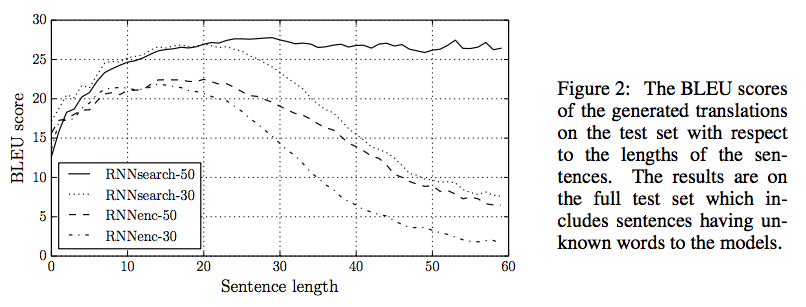

## title
Neural Machine Translation by Jointly Leaning to Align and Translate

## abstruct
現在の統計的な機械翻訳ではなく一つのNNを使用した翻訳のパフォーマンスを最大化してみようというもの。  
これまでに提案されているencoder-decoderモデルの翻訳機では入力文を変換して作成した固定長のベクトルの使い道がボトルネックになっているので、
このモデルを拡張する形で、予想している単語に関連性のある部分を入力から自動でsoft-searchすることを許すようにしている。  
この手法をとることで現在のSOTAと比較することができるまでの結果を得ることができるようになった。

## background
NMTは2013年に提案された新しい手法で、従来のフレーズベースの多くの別々にチューニングされる小さいsub-componentsを持つものではなく、
一つの大きなNNが文章を読み込み正しい翻訳を出力するというものである。  
多くのNMTモデルはencoder-decoderを元にしたものであり、二言語のペアからモデルを学習する。  
従来のencoder-decoderモデルで問題になっていたものは一つのNNが入力文章の必要な情報を全て固定長のベクトルに圧縮する必要があったことである。
このためNNにとって長文の扱いが難しいものになっていた。
本問題を解決するために、本論文ではこれを拡張し調整しながら翻訳するモデルを提案している。  
提案されているモデルは、翻訳を生成するたびに、入力の本分の中から、最も関連する箇所に注目する。  
つまり入力から生成されたベクトルの中から、最適な部分集合を翻訳中に選択している。これによって長文においても良い翻訳結果を得ている。

## method
提案手法では、bidirectional RNNをエンコーダーとして持っており、デコーダーは翻訳をでコーディング中に入力を検索しようとする。  
数式は省略するが、RNNの隠れパラメータ等からcontext vector c_tを計算してそれを利用して、デコード時に注目すべき入力を決定している。 よってエンコーダーが入力文すべての情報を固定長ベクトルにする負担を和らげている。  
biRNNはi時点での単語に対する重みにこれまでの単語とこれから登場する単語の情報を与えるのに役立っている。biRNNで計算された二つの隠れパラメータは連結される。  
学習データにはEnglish-Frenceデータを利用し、評価にはBLEUを利用している。

## results
<figure>
  
  <figcaption>result1</figcaption>
</figure>
<figure>
  
  <figcaption>result2</figcaption>
</figure>

特徴的な結果としては、形容詞と名詞の並べる語順が異なる両言語で提案手法は正しく翻訳することができた。  

## discussion
本手法により、デコード時に入力文の重要な箇所に注目して固定長ベクトルにすることで、より良い翻訳結果を得ることができることを明らかにした。  
今後の展開としては、未知語や出現頻度の低い単語に対するハンドリングが必要になってくる。

## my impressions
この論文の中で最も注目すべき点としては、論文中でも繰り返し語られてきたが、デコード時にAttensionをかけて入力文章を検索することであるように感じる。
biRNNを使用して、一つの単語に注目した際に前後の文脈に注目しようとしていることは興味深かったが、両方の順序を平等に扱っている点に関しては、
さらに次元の高い視点から、より良いハンドリングの仕方があるのではないかと感じた。（日本語は最後、英語は最初に要点を持ってくるみたいな）  
googleも翻訳をNNを使用することにしているので、これからは流行ってきそう。seq2seq等いろいろな手法が出てきているのでそれぞれ見てみたい。
