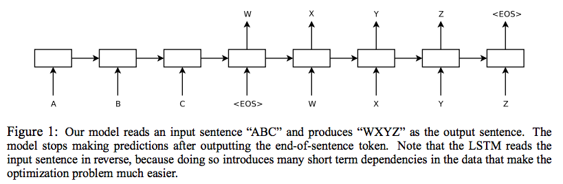
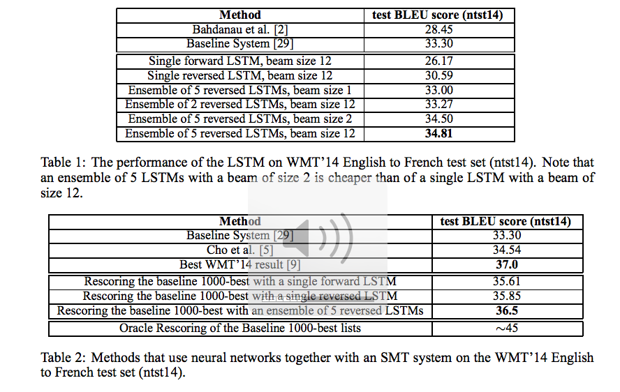

## title
Sequence to Sequence Leaning with Neural Networks

## abstruct
DNNsは現在大きな、ラベルの付いているトレーニングセットが用意できる問題に対して非常に有用であることがわかっているが、SequenceからSequenceにmapすることに使用することができない。  
本論文では、一般的なend-to-endの連続たいを学習するアプローチについて紹介する。  
LSTMを複数レイヤーしたものをSequenceを固定長のベクトルにmapするのに使用し、他の深いLSTMをベクトルからSequenceに復号するのに使用する。  
題材としては、英語-フランス語翻訳タスクで、WMT'14 データセットを使用する。  
また入力文章の単語の順序を入れ替えて入力することで大きくパフォーマンスを向上させることを発見した。

## background
現状でのDNNでは入力とターゲットが固定長のベクトルでのみ有効であるが、これは非常に大きい制限である。多くの問題が長さのわからない連続隊の情報であるからである。
質疑応答タスクもまた単語の連続隊のマッピングと見ることができる。  
<figure>
  
  <figcaption>results</figcaption>
  </figcaption>
</figure>
本論文では簡単な、LSTMを持つアプリケーションが一般的な連続体から連続体への変換タスクをとくことを紹介する。  
アイディアは一つのLSTMが入力を逐次時間読み込み、大きな固定長のベクトル表現を取得する、そして、もう一つのLSTMがそこから出力となる連続体を抽出する。二つ目のLSTMは基本的に入力によって調整されるRNNである。  

## method
<figure>
  
  <figcaption>results</figcaption>
  </figcaption>
</figure>
LSTMの隠れそうの状態から得られた入力Xの固定長の特徴ベクトルを元にした条件付き確率を計算するものである。  
今回の実験で使用しているモデルは入力と出力それぞれにLSTMを一つづつ使用しており、そのLSTMはそれぞれ4層持っている。そして入力は順序を反転したものを使用する。  
入力を反転しているのはそれが、SGDにとって入力と出力の間に「確立されたコミュニケーション」を作るのが簡単になるからである。  
入力を反転させたことによって精度が上昇したのは、反転せずに入力と出力を連結すると、対応する単語同士の距離は遠くなるが、入力を反転することにより近くなることが考えられる。  

## results
<figure>
  
  <figcaption>results</figcaption>
  </figcaption>
</figure>

## discussion
本実験ではLSTMが限られた語彙の中からdeep LSTMがほとんど問題の構造に対する過程を保持していない状態で、SMT-basedを凌駕することができたことを示すことができた。  
また入力を反転することで精度を上昇させることができることも発見した。またLSTMが正しく非常に長い文章を翻訳することができる能力に対して驚いた。  

## my impression
不確定の長さのベクトルを固定長に変換する手法は現在多く取られているが、この論文で面白かったのは、入力を反転することで精度が上がり、その理由として
反転すると入力と出力の対応する語が近くなるから。と言っていることであった。本当にそうなのか？と思った反面、もしそうだとしたら、自然言語翻訳だけではなくいろいろなタスク、  
ましてや自然言語以外で時系列を扱うようなタスクがあった際に考慮してもいいかもしれないという点で興味深かった。
