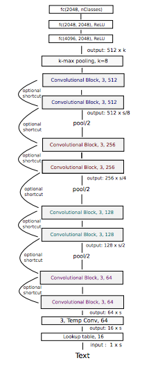
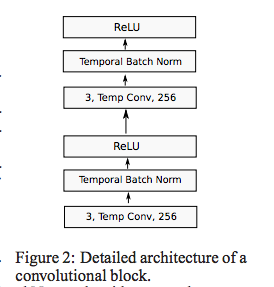
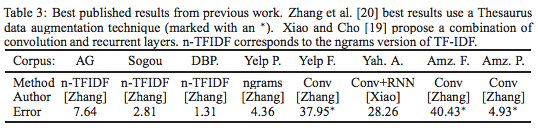
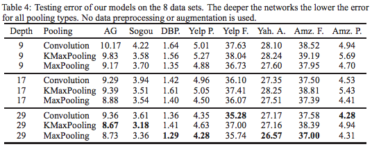

## title
Very Deep Convolutional Networks for Natural Language Processing

## abstruct
LSTMやRNNが台頭しているが、CV等に用いられるネットワークに比べて浅いネットワークになっている。  
本論文では文字レベルで、小さいconvolutionとpoolingを用いて言語処理を行った。  
最大29層のconvolution層を用いることで、テキスト分類において大きな進展を出した。

## background
現在のNLP分野では単語レベルでのembeddingがSOTAであるが、長文や複雑な文法や意味的な関係性の中では、
その正しさに、透明性が欠ける。  
また現在は、LSTMを用いた連続性を記憶することを期待した手法が主に成功を収めているが、ここでは
LSTMを用いた手法は特定の構造を欠いた汎用的な機械学習手法であると考える。  
一階層の隠れ層を用いたネットワークは原理的に実数値関数を学習することができるが、
深い階層の問題に対して最適化された構造のネットワークの方が、階層性のある表現をよりよく学習する。  
つまりLSTM、 RNNは非構造であり、特定タスク特化型のものではない。  
現状、4層の階層化されたLSTMレイヤーを超えるものが観察されたものが、drop-outを用いた正規化を用いたとしても、存在しない。  
本論文ではCVに影響された最大で29層のconvolutional層を使用した構造を提案する。

## method
<figure>
  
  <figcaption>network struction</figcaption>
</figure>
アーキテクチャは上記のようになっており、入力は文字レベルの分散表現となっている。  
最終的な出力は、高レベルな入力文字列の表現のtensorになっている。（入力は固定長のs_dである）  
本手法では、小さい畳み込み層(3 layers)をたくさん使用した構造を提唱する。この構造により、ネットワークは自身で3-gramの特徴を選択するか学習することができる。  
クラスタリングの全結合ネットワークに入る前に、k-max pooling層を通過させることで、入力文中のk個の重要な特徴を、文中での位置とは独立に抽出している。
そして、512 * kの結果の特徴は一つのベクトルとして、ReLUを隠れ層にもつネットワークへの入力となる。  
本実験ではdrop-outを用いない方が良い結果が出ており、temporaly convolution層あとでのbatch normalizationのみを使用している  

------

### convolutional block
<figure>
  
  <figcaption>convolutional block</figcaption>
</figure>
convolutional blockは二層の畳み込み層からなり、それぞれの畳み込み層の後にはtemporal batch normalizationが続いている。  

## results
<figure>
  
  <figcaption>previous work results</figcaption>
</figure>

<figure>
  
  <figcaption>results</figcaption>
</figure>

- 本実験での深い構造は大きいデータセットに対して有効であった。
- 層を深くすることによって、より良い結果を得ることができる。
- pooling層においては、max-poolingが最も良い結果を出した。
- shortcut connectionが勾配消失問題の解決につながる。

## discussion
今後の方針としては、CVの成功を追いより多くのクラスを持つ分類問題に特化した、深いネットワークを作ることが興味深いトピックとなりそう。

## my impression
- CVで培われた手法をNLPに応用する始発になりそう
- 大規模データセットを集められるかどうかが、NLPでも大きいタスクになってきそう
- 日本語を分かち書きしなくていいというのは画期的。
- 感情分析等失敗したくないタスクに対して、最適されたネットワークとか出てきたら便利。
